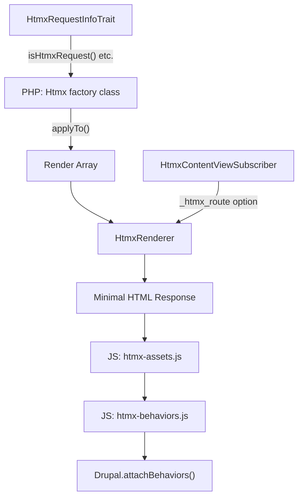

# HTMX in Drupal 11.3 — Orientation Guide

Drupal 11.3 ships a first-class HTMX integration intended to eventually replace the legacy AJAX Framework. HTMX 2.0.4 is vendored in core.

---

## Architecture at a Glance



---

## Core PHP Classes

### 1. `Htmx` Factory — [Htmx.php](file:///Users/andreangelantoni/Sites/pl-d11-test/web/core/lib/Drupal/Core/Htmx/Htmx.php)

The central class: a **fluent builder** that maps every HTMX attribute and response header to a PHP method, then applies them to render arrays.

**Request attributes** (HTTP verbs):
| Method | Attribute | Description |
|---|---|---|
| `get()` | `data-hx-get` | Issue GET request |
| `post()` | `data-hx-post` | Issue POST request |
| `put()` | `data-hx-put` | Issue PUT request |
| `patch()` | `data-hx-patch` | Issue PATCH request |
| `delete()` | `data-hx-delete` | Issue DELETE request |

**Content control attributes**:
| Method | Attribute |
|---|---|
| `select()` | `data-hx-select` — CSS selector for response content |
| `selectOob()` | `data-hx-select-oob` — Out-of-band content selection |
| `target()` | `data-hx-target` — Swap target element |
| `swap()` | `data-hx-swap` — Swap strategy (`innerHTML`, `outerHTML`, etc.) |
| `swapOob()` | `data-hx-swap-oob` — Out-of-band swap |
| `trigger()` | `data-hx-trigger` — When to fire the request |
| `vals()` | `data-hx-vals` — Extra parameters as JSON |

**Behavior attributes**: `boost()`, `confirm()`, `disable()`, `disabledElt()`, `disinherit()`, `encoding()`, `ext()`, `headers()`, `history()`, `historyElt()`, `include()`, `indicator()`, `inherit()`, `on()`, `params()`, `preserve()`, `prompt()`, `pushUrl()`, `replaceUrl()`, `request()`, `sync()`, `validate()`

**Drupal-specific**: `onlyMainContent()` — adds `data-hx-drupal-only-main-content` to trigger the `?_wrapper_format=drupal_htmx` query param via JS.

**Response headers** (11 total):
| Method | Header |
|---|---|
| `locationHeader()` | `HX-Location` |
| `pushUrlHeader()` | `HX-Push-Url` |
| `replaceUrlHeader()` | `HX-Replace-Url` |
| `redirectHeader()` | `HX-Redirect` |
| `refreshHeader()` | `HX-Refresh` |
| `reswapHeader()` | `HX-Reswap` |
| `retargetHeader()` | `HX-Retarget` |
| `reselectHeader()` | `HX-Reselect` |
| `triggerHeader()` | `HX-Trigger` |
| `triggerAfterSettleHeader()` | `HX-Trigger-After-Settle` |
| `triggerAfterSwapHeader()` | `HX-Trigger-After-Swap` |

**Key methods**:
- `applyTo(array &$element)` — attaches attributes, headers, cache metadata, and the `core/drupal.htmx` library to a render array
- `createFromRenderArray()` — factory to create an `Htmx` instance from an existing render array

> [!IMPORTANT]
> Drupal uses `data-hx-*` prefix (not `hx-*`) for valid HTML output.

---

### 2. `HtmxRequestInfoTrait` — [HtmxRequestInfoTrait.php](file:///Users/andreangelantoni/Sites/pl-d11-test/web/core/lib/Drupal/Core/Htmx/HtmxRequestInfoTrait.php)

Trait for controllers/forms. Provides 7 helpers reading HTMX request headers:

| Method | Header Read |
|---|---|
| `isHtmxRequest()` | `HX-Request` |
| `isHtmxBoosted()` | `HX-Boosted` |
| `getHtmxCurrentUrl()` | `HX-Current-URL` |
| `isHtmxHistoryRestoration()` | `HX-History-Restore-Request` |
| `getHtmxPrompt()` | `HX-Prompt` |
| `getHtmxTarget()` | `HX-Target` |
| `getHtmxTrigger()` / `getHtmxTriggerName()` | `HX-Trigger` / `HX-Trigger-Name` |

`FormBase` already uses this trait — any form can call `$this->isHtmxRequest()` etc.

---

### 3. `HtmxRenderer` — [HtmxRenderer.php](file:///Users/andreangelantoni/Sites/pl-d11-test/web/core/lib/Drupal/Core/Render/MainContent/HtmxRenderer.php)

A **dedicated main content renderer** that returns a minimal HTML document (no page blocks/regions, no theme chrome) containing only:
- `<title>`
- CSS/JS placeholders (processed by `HtmlResponseAttachmentsProcessor`)
- Status messages + main content in `<body>`

Triggered by either:
1. `?_wrapper_format=drupal_htmx` query param (set automatically by JS when `onlyMainContent()` is used)
2. Route option `_htmx_route: TRUE` (detected by `HtmxContentViewSubscriber`)

---

### 4. `HtmxContentViewSubscriber` — [HtmxContentViewSubscriber.php](file:///Users/andreangelantoni/Sites/pl-d11-test/web/core/lib/Drupal/Core/EventSubscriber/HtmxContentViewSubscriber.php)

Event subscriber at **priority 100** (before `MainContentViewSubscriber` at 0). Auto-routes responses through `HtmxRenderer` for any route with `_htmx_route: TRUE` option.

---

## JavaScript Integration

Three files in `core/misc/htmx/`, loaded via the `core/drupal.htmx` library:

| File | Purpose |
|---|---|
| [htmx-utils.js](file:///Users/andreangelantoni/Sites/pl-d11-test/web/core/misc/htmx/htmx-utils.js) | `Drupal.htmx.mergeSettings()` + `Drupal.htmx.addAssets()` for runtime asset loading via `loadjs` |
| [htmx-assets.js](file:///Users/andreangelantoni/Sites/pl-d11-test/web/core/misc/htmx/htmx-assets.js) | Hooks into HTMX events to: inject `_wrapper_format`, send `ajax_page_state`, diff-load CSS/JS, fire `htmx:drupal:load` |
| [htmx-behaviors.js](file:///Users/andreangelantoni/Sites/pl-d11-test/web/core/misc/htmx/htmx-behaviors.js) | Bridges HTMX swaps ↔ `Drupal.behaviors` via `attachBehaviors`/`detachBehaviors` |

**Custom events**:
- `htmx:drupal:load` — fired after swap settles AND all assets loaded → safe to run JS on new content
- `htmx:drupal:unload` — fired before swap → detach behaviors

---

## BigPipe Integration

BigPipe now depends on `core/htmx` and `core/drupal.htmx`. It uses HTMX on the frontend for streaming placeholder replacement, reducing its JavaScript footprint significantly.

---

## Libraries

```yaml
# core/core.libraries.yml

htmx:                         # Vendor library (htmx 2.0.4)
  js:
    assets/vendor/htmx/htmx.min.js: { minified: true }

drupal.htmx:                  # Drupal integration layer
  js:
    misc/htmx/htmx-utils.js: {}
    misc/htmx/htmx-assets.js: {}
    misc/htmx/htmx-behaviors.js: {}
  dependencies:
    - core/htmx
    - core/drupal
    - core/drupalSettings
    - core/loadjs
```

---

## Real-World Example: Config Single Export Form

[ConfigSingleExportForm.php](file:///Users/andreangelantoni/Sites/pl-d11-test/web/core/modules/config/src/Form/ConfigSingleExportForm.php) — the first core form converted from AJAX to HTMX:

```php
// Make the type selector trigger an HTMX POST that swaps just the name dropdown
(new Htmx())
  ->post($form_url)
  ->onlyMainContent()                              // minimal response
  ->select('*:has(>select[name="config_name"])')    // pick this from response
  ->target('*:has(>select[name="config_name"])')    // replace this on page
  ->swap('outerHTML')
  ->applyTo($form['config_type']);

// Update browser URL when a config name is selected
(new Htmx())
  ->pushUrlHeader($pushUrl)
  ->applyTo($form);

// Out-of-band swap the export textarea when type changes
(new Htmx())
  ->swapOob('outerHTML:[data-export-wrapper]')
  ->applyTo($form['export'], '#wrapper_attributes');
```

**Pattern**: Uses `getHtmxTriggerName()` (from the trait via `FormBase`) to detect *which* element triggered the HTMX request and conditionally rebuild only the relevant parts.

---

## Quick-Start Recipe for a Custom HTMX Form

```php
use Drupal\Core\Form\FormBase;
use Drupal\Core\Htmx\Htmx;

class MyForm extends FormBase {
  public function buildForm(array $form, FormStateInterface $form_state) {
    $form['country'] = [
      '#type' => 'select',
      '#options' => $countries,
    ];
    
    // When country changes → POST to current URL, swap the city dropdown
    (new Htmx())
      ->post()                    // POST to current URL
      ->onlyMainContent()         // use HtmxRenderer
      ->select('#city-wrapper')   // pick this from response
      ->target('#city-wrapper')   // replace this on page
      ->swap('outerHTML')
      ->applyTo($form['country']);
    
    $selectedCountry = $form_state->getValue('country');
    $form['city'] = [
      '#type' => 'select',
      '#options' => $this->getCities($selectedCountry),
      '#prefix' => '<div id="city-wrapper">',
      '#suffix' => '</div>',
    ];
    
    return $form;
  }
}
```

---

## Key Takeaways

1. **No JS needed** for dynamic forms — the Htmx PHP class does everything declaratively
2. **`applyTo()`** auto-attaches the `core/drupal.htmx` library, so you never need to manually declare it
3. **`onlyMainContent()`** triggers the lean `HtmxRenderer` — returns only main content + diff'd CSS/JS
4. **`FormBase` already has `HtmxRequestInfoTrait`** — use `$this->getHtmxTriggerName()` to detect which element fired
5. **Out-of-band swaps** (`swapOob`) allow updating multiple regions in a single response
6. **History integration** via `pushUrlHeader()` / `replaceUrlHeader()` for deep-linkable dynamic content
7. **BigPipe already uses HTMX** — it's a core dependency, not optional
8. **`data-hx-*`** prefix (not `hx-*`) — Drupal enforces valid HTML
