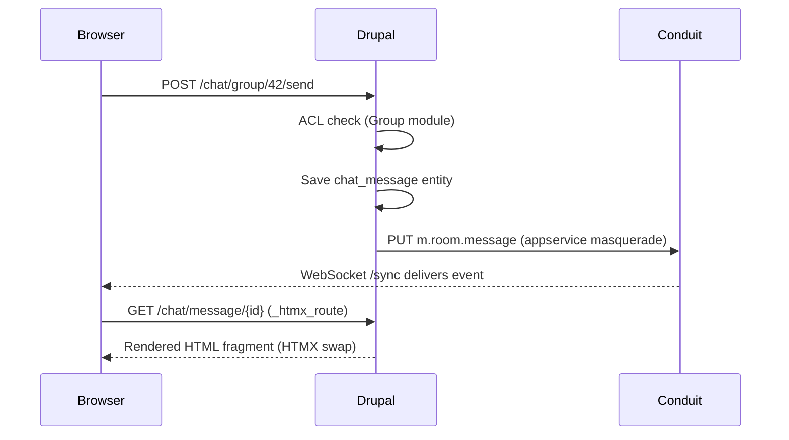

# Implementation Plan: Drupal + HTMX + Matrix Real-Time Chat

Based on [REALTIME_CHAT_ARCHITECTURE.md](file:///Users/andreangelantoni/Sites/pl-d11-test/doc/REALTIME_CHAT_ARCHITECTURE.md).

## Non-Negotiables

1. **Drupal owns all writes and ACL** — no client submits directly to Matrix
2. **No polling** — matrix-js-sdk WebSocket `/sync` for push, HTMX only for DOM updates

## Architecture



---

## Phase 1 — Matrix Sidecar in DDEV

### Deliverables

| File | Type | Purpose |
|---|---|---|
| `.ddev/docker-compose.conduit.yaml` | NEW | Conduit as DDEV sidecar service |
| `.ddev/conduit/conduit.toml` | NEW | Homeserver config (no federation, no open registration) |
| `.ddev/conduit/appservice-drupal.yaml` | NEW | Appservice registration for Drupal |

### Config Details

**conduit.toml** — Conduit chosen over Synapse for dev: ~10MB RAM, single binary, embedded RocksDB. Production-swappable since all calls use standard Matrix Client-Server API.

```toml
[global]
server_name = "chat.ddev.site"
database_backend = "rocksdb"
port = 6167
allow_registration = false
allow_federation = false
```

**appservice-drupal.yaml** — exclusive `@_drupal_*` user namespace, Drupal webhook URL.

```yaml
id: "drupal-chat"
url: "http://web:80/matrix/appservice"
as_token: "<generated>"
hs_token: "<generated>"
sender_localpart: "_drupal_bot"
namespaces:
  users:
    - exclusive: true
      regex: "@_drupal_.*"
  aliases:
    - exclusive: true
      regex: "#_drupal_.*"
```

### Phase 1 Tests

#### Unit Tests
- **ConduitConfigTest** — validate TOML parses correctly, required keys present
- **AppserviceRegistrationTest** — validate YAML has required fields (`as_token`, `hs_token`, `sender_localpart`, namespaces)

#### E2E Tests
- **ConduitHealthCheckTest** — `ddev exec curl conduit:6167/_matrix/client/versions` returns JSON with `versions` array
- **ConduitRegistrationBlockedTest** — `POST /register` without appservice token returns `M_FORBIDDEN` (open registration is off)
- **AppserviceUserCreateTest** — `POST /register` with `as_token` and `@_drupal_test:server` succeeds (appservice can create users in its namespace)

---

## Phase 2 — Drupal `matrix_bridge` Module: Core Service

### Deliverables

| File | Type | Purpose |
|---|---|---|
| `matrix_bridge.info.yml` | NEW | Module definition |
| `matrix_bridge.services.yml` | NEW | Service definitions |
| `config/install/matrix_bridge.settings.yml` | NEW | Default config (homeserver URL, tokens) |
| `src/MatrixClient.php` | NEW | Guzzle wrapper for Matrix Client-Server API |
| `src/Entity/ChatMessage.php` | NEW | Lightweight content entity |

### MatrixClient Service

Single service wrapping the Matrix API. All calls use `as_token` auth with `?user_id=` masquerading — no per-user token table needed.

```php
class MatrixClient {
  public function createRoom(string $name, string $alias): string;
  public function inviteUser(string $roomId, string $matrixUserId): void;
  public function kickUser(string $roomId, string $matrixUserId): void;
  public function banUser(string $roomId, string $matrixUserId): void;
  public function sendMessage(string $roomId, string $userId, string $body): string;
  public function ensureUserExists(int $drupalUid): string;
}
```

### ChatMessage Entity

```
chat_message: id, uuid, uid, group_id, matrix_event_id, body, created
```

### Phase 2 Tests

#### Unit Tests
- **MatrixClientCreateRoomTest** — mock Guzzle, verify correct API path (`POST /createRoom`), request body (`name`, `room_alias_name`), and `as_token` auth header
- **MatrixClientSendMessageTest** — mock Guzzle, verify masquerade `?user_id=@_drupal_42:server` query param, correct event type `m.room.message`, transaction ID
- **MatrixClientInviteTest** — verify `POST /invite` with correct room ID and user ID
- **MatrixClientKickTest** — verify `POST /kick` body and auth
- **MatrixClientEnsureUserTest** — verify `POST /register` with `type: m.login.application_service`
- **ChatMessageEntityTest** — entity creates with all fields, `matrix_event_id` stores correctly

#### E2E Tests
- **MatrixRoomCreationTest** — enable module → `MatrixClient::createRoom()` → verify room exists via Conduit API (`GET /directory/room/{alias}`)
- **MatrixUserCreationTest** — `ensureUserExists(1)` → verify `@_drupal_1:server` registered on Conduit (`GET /profile/@_drupal_1:server`)
- **MatrixMessageSendTest** — create room → send message → verify event appears in room timeline via Conduit API (`GET /rooms/{roomId}/messages`)
- **ChatMessagePersistenceTest** — send a message → verify `ChatMessage` entity saved in Drupal DB with correct `matrix_event_id`

---

## Phase 3 — Group Lifecycle Hooks

### Deliverables

| File | Type | Purpose |
|---|---|---|
| `src/Hook/MatrixBridgeHooks.php` | NEW | Group module event subscribers |
| `matrix_bridge.routing.yml` | NEW | Appservice webhook route |
| `src/Controller/AppserviceController.php` | NEW | Receives Matrix transaction pushes |

### Hook Mapping

| Drupal Event | Matrix Action |
|---|---|
| Group created | `createRoom()` + store room_id |
| User joins group | `inviteUser()` + auto-accept |
| User leaves/removed | `kickUser()` |
| User banned | `banUser()` |
| Group deleted | Tombstone room |

### Phase 3 Tests

#### Unit Tests
- **GroupCreatedHookTest** — mock MatrixClient, fire group insert → verify `createRoom()` called with group name, room_id stored on group entity
- **UserJoinHookTest** — fire group membership grant → verify `ensureUserExists()` + `inviteUser()` called in sequence
- **UserLeaveHookTest** — fire membership revoke → verify `kickUser()` called with correct room/user
- **UserBanHookTest** — fire ban → verify `banUser()` called
- **GroupDeleteHookTest** — fire group delete → verify tombstone event sent
- **AppserviceAuthTest** — webhook request without `hs_token` returns 401; with valid token returns 200

#### E2E Tests
- **GroupToRoomLifecycleTest** — create group (Drupal) → verify Matrix room exists (Conduit) → add member (Drupal) → verify Matrix invite (Conduit) → remove member → verify kick → delete group → verify room tombstoned
- **ACLEnforcementTest** — user NOT in group → cannot send message (Drupal returns 403), even if they somehow have a valid Matrix token
- **AppserviceWebhookTest** — send a test transaction to `/matrix/appservice/transactions/1` with valid `hs_token` → 200 response

---

## Phase 4 — HTMX Chat UI

### Deliverables

| File | Type | Purpose |
|---|---|---|
| `src/Controller/ChatController.php` | NEW | Chat page + message render + message send |
| `matrix_bridge.routing.yml` | MODIFY | Add chat routes |
| `templates/chat-page.html.twig` | NEW | Chat container layout |
| `templates/chat-message.html.twig` | NEW | Single message (HTMX swap target) |

### Routes

```yaml
matrix_bridge.chat_page:
  path: '/chat/group/{group}'
  options: { _htmx_route: false }    # full page

matrix_bridge.send_message:
  path: '/chat/group/{group}/send'
  methods: [POST]

matrix_bridge.render_message:
  path: '/chat/message/{chat_message}'
  options: { _htmx_route: true }     # minimal HTML
```

### HTMX Patterns

```php
// Send button
(new Htmx())
  ->post(Url::fromRoute('matrix_bridge.send_message', ['group' => $gid]))
  ->target('#chat-messages')->swap('beforeend')
  ->onlyMainContent()
  ->applyTo($form['submit']);

// Unread badge (OOB swap in every message response)
(new Htmx())->swapOob('innerHTML:#unread-count')->applyTo($badge);
```

### Phase 4 Tests

#### Unit Tests
- **ChatPageRenderTest** — verify chat page render array contains `#chat-messages` target div, HTMX attributes on send form
- **SendMessageControllerTest** — mock MatrixClient + entity storage, POST message → verify entity created, `sendMessage()` called, response contains rendered message HTML
- **RenderMessageHtmxTest** — verify `_htmx_route` produces response without page chrome (no `<html>`, contains message body)
- **ACLOnChatPageTest** — non-member requesting `/chat/group/{id}` gets 403
- **OobSwapPresenceTest** — verify message response includes OOB swap markup for unread badge

#### E2E Tests (Browser)
- **ChatPageLoadTest** — log in as group member → navigate to `/chat/group/{id}` → page loads with chat container, message input, send button with `data-hx-post` attribute
- **SendMessageFlowTest** — type message → click send → HTMX POST fires → new message appears in `#chat-messages` without page reload
- **ACLBlockedTest** — log in as non-member → navigate to chat page → 403 access denied
- **MessageRenderFormatTest** — directly request `/chat/message/{id}?_wrapper_format=drupal_htmx` → response is minimal HTML document (no theme blocks)

---

## Phase 5 — Browser Real-Time Integration

### Deliverables

| File | Type | Purpose |
|---|---|---|
| `js/matrix-chat.js` | NEW | matrix-js-sdk + HTMX bridge |
| `matrix_bridge.libraries.yml` | NEW | Library definitions |
| `src/Controller/MatrixTokenController.php` | NEW | Token endpoint for browser |

### Transport Split

| Feature | Channel | Why |
|---|---|---|
| Message rendering | matrix-js-sdk → `htmx.ajax()` → Drupal | ACL-aware themed render |
| Send message | HTMX POST → Drupal | Validation + save + forward |
| Typing indicator | matrix-js-sdk → direct DOM | Low-latency, ephemeral |
| Presence dots | matrix-js-sdk → direct DOM | Low-latency, ephemeral |
| Read receipts | matrix-js-sdk → direct DOM | Client-only UX |

### Token Endpoint

```php
// GET /api/matrix/token — returns only if user has group membership
// Response: { homeserverUrl, accessToken, userId, roomId }
```

### Phase 5 Tests

#### Unit Tests
- **MatrixTokenControllerTest** — non-member gets 403; member gets JSON with required keys (`homeserverUrl`, `accessToken`, `userId`, `roomId`)
- **TokenScopeTest** — token returned matches the `@_drupal_<uid>:server` format
- **LibraryAttachmentTest** — verify `matrix-chat` library depends on `core/drupal.htmx` and `matrix_bridge/matrix-sdk`

#### E2E Tests (Browser — two sessions)
- **RealTimeMessageDeliveryTest** — User A and User B both on chat page → A sends message via HTMX POST → message appears in B's chat container via WebSocket (no polling, no page reload)
- **TypingIndicatorTest** — User A starts typing → User B sees typing indicator update in DOM
- **PresenceTest** — User A navigates away → User B's presence dot changes status
- **ReconnectCatchUpTest** — Disconnect User B's WebSocket (network simulation) → A sends messages → B reconnects → matrix-js-sdk `/sync?since=<token>` delivers missed messages automatically
- **MultiTabTest** — User A opens two tabs → sends message → both tabs update (matrix-js-sdk SharedWorker)
- **LogoutRevocationTest** — User logs out of Drupal → Matrix token invalidated → WebSocket disconnects and does not reconnect

---

## Module File Tree

```
web/modules/custom/matrix_bridge/
├── matrix_bridge.info.yml
├── matrix_bridge.services.yml
├── matrix_bridge.routing.yml
├── matrix_bridge.libraries.yml
├── config/install/
│   └── matrix_bridge.settings.yml
├── src/
│   ├── MatrixClient.php
│   ├── Entity/ChatMessage.php
│   ├── Controller/
│   │   ├── ChatController.php
│   │   ├── MatrixTokenController.php
│   │   └── AppserviceController.php
│   └── Hook/MatrixBridgeHooks.php
├── js/matrix-chat.js
├── templates/
│   ├── chat-page.html.twig
│   └── chat-message.html.twig
└── tests/
    ├── src/Unit/
    │   ├── MatrixClientTest.php
    │   ├── ChatMessageEntityTest.php
    │   ├── GroupHooksTest.php
    │   ├── ChatControllerTest.php
    │   └── MatrixTokenControllerTest.php
    ├── src/Kernel/
    │   ├── MatrixRoomCreationTest.php
    │   ├── ChatMessagePersistenceTest.php
    │   ├── GroupToRoomLifecycleTest.php
    │   └── ACLEnforcementTest.php
    └── src/FunctionalJavascript/
        ├── ChatPageLoadTest.php
        ├── SendMessageFlowTest.php
        ├── RealTimeMessageDeliveryTest.php
        ├── TypingIndicatorTest.php
        └── ReconnectCatchUpTest.php
```
